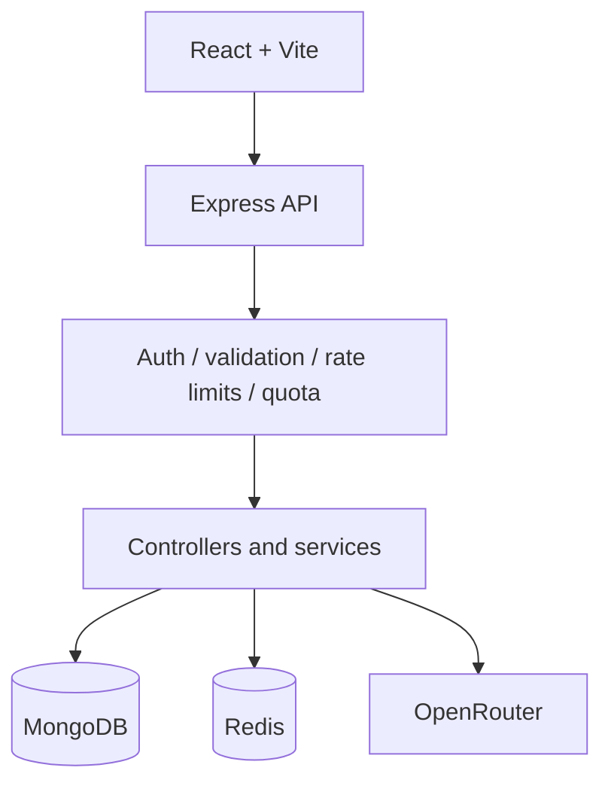

# Orbit AI

Orbit Arena is a full-stack AI conversation workspace built with React, Express, MongoDB, Redis, and OpenRouter.

## Features

- Cookie-based authentication with JWT
- Persistent chats and messages
- OpenRouter model integration
- Redis request rate limiting and token quotas
- Conversation context and summarization
- Security headers, CORS, health/readiness checks, and graceful shutdown
- Responsive gaming/sports-inspired React interface
- Abortable SSE generation with Stop/Retry controls
- Expiring Redis locks for summary concurrency
- Atomic Redis quota reservations and configurable rate limits
- MongoDB transaction protection for paired messages and account deletion

## Local setup

1. Copy `.env.example` to `.env` and fill in MongoDB, Redis, JWT, and OpenRouter values.
   Set `ALLOWED_MODELS` to the comma-separated OpenRouter model IDs that users may select.
   `AI_REQUEST_TIMEOUT_MS` limits non-streaming provider calls. Streaming uses separate first-byte and idle timeouts.
2. Start the backend:

   ```powershell
   npm install
   npm run dev
   ```

3. Start the frontend in another terminal:

   ```powershell
   cd client
   npm install
   copy .env.example .env
   npm run dev
   ```

4. Open `http://localhost:5173`.

Run backend tests with `npm test` and build the frontend with `cd client; npm run build`.

## Architecture



JWTs are stored in HttpOnly cookies. MongoDB stores users, chats, messages, summaries, and usage totals. Redis provides atomic request limits, token-window reservations, logout revocation, and short-lived summary locks. Message pairs and account deletion use MongoDB transactions when supported by the deployment.

Streaming responses are Server-Sent Events. The browser sends an `AbortSignal`; disconnects abort the provider request and partial responses are not persisted. Non-streaming provider calls use an abortable timeout and retry only retryable provider failures.

The API accepts only models listed in `ALLOWED_MODELS`, validates IDs and message size server-side, scopes all chat/message queries to the authenticated user, and renders AI content without executing HTML. `/health` is liveness; `/ready` reports MongoDB and Redis readiness.

## Production considerations

Use a strong random `JWT_SECRET`, HTTPS, a restricted `CORS_ORIGINS`, managed MongoDB/Redis with backups, and a reverse proxy with request-size/time limits. Redis is fail-closed for authenticated rate limits, quota enforcement, and logout revocation; the public rate limiter fails open to preserve availability for validation and health traffic.

## Docker

```powershell
docker compose up --build
```

The API is available at `http://localhost:3000`; the frontend is available at `http://localhost:5173`.

For Docker, set `OPENROUTER_API_KEY` and a random `JWT_SECRET` in the root `.env`.

## Health

- `GET /health` — process liveness
- `GET /ready` — MongoDB and Redis readiness

## API overview

| Area | Endpoints |
| --- | --- |
| Auth | `POST /user/signup`, `POST /user/login`, `POST /user/logout`, `GET /user/profile` |
| Chats | `POST /chat/createChat`, `GET /chat/getRecentChat`, `GET /chat/:chatId`, `DELETE /chat/:chatId` |
| Messages | `POST /msg`, `POST /msg/:chatId`, `GET /msg/:chatId` |

Message streaming is available through `POST /msg/stream` and
`POST /msg/:chatId/stream`. These return Server-Sent Events and use the same
cookie authentication and request body as the normal message endpoints.

The browser client uses `credentials: include`; configure `CORS_ORIGINS` to match the deployed frontend origin.
